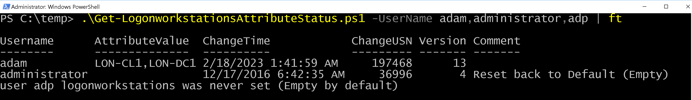

# Get-LogonworkstationsAttributeStatus
Essentially, a One-liner to get the latest Change (if ever) in userWorkstations attribute value (Logon restrictions by user workstations) using Replication property MetaData, without any logging/auditing required. 

No special permissions required, just an authenticated domain user. Requires the ActiveDirectory powershell module. Supports querying multiple users.

Example results:

Username = The samacccount name of the queried user account

AttributeValue = The new (current) attribute value. normally, list of comma-separated hosts, or empty.

ChangeTime = the LastOriginatingChangeTime property, when the last update occured.

ChangeUSN = the LastOriginatingChangeUsn property, the universal sequencial number of replication, a unique identifier of this replication activity.

Version = The number of times this property has been updated (e.g. 2 means twice)

Comment = a generated field used to indicate that the empty value field doesn't mean it was never set, yet that it was deliberately Reset Back to the default Empty value (Cleared).

### To get all changes for all properties, including userWorkstations, as well as who did the change (the subject user), see [Get-ChangesInADUser](https://www.github.com/YossiSassi/Get-ChangesInADUser) script.
